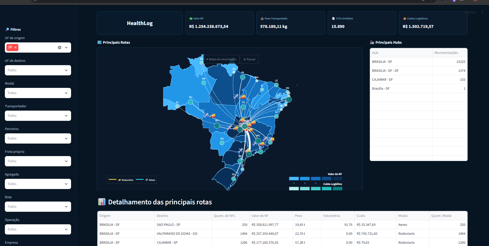

# HealthLog — Dashboard de Malha Logística

Dashboard interativo para análise da malha logística, desenvolvido para consolidar indicadores operacionais, visualizar rotas de transporte e facilitar a identificação dos principais fluxos, hubs e custos da operação.

A aplicação apresenta dados de notas fiscais, peso transportado, CT-es emitidos e custos logísticos em uma interface responsiva, com filtros dinâmicos e mapa do Brasil.

## Prévia do dashboard

<p align="center">
  
</p>

## Funcionalidades

- Indicadores de valor total das notas fiscais, peso transportado, CT-es emitidos e custos logísticos.
- Mapa do Brasil com estados coloridos em tons de azul conforme o valor das notas fiscais.
- Marcadores em tons de verde conforme o custo logístico de cada UF.
- Visualização das principais rotas rodoviárias e aéreas.
- Animação de veículos ao longo das rotas.
- Identificação dos principais hubs e suas movimentações.
- Detalhamento por origem, destino, quantidade de notas, valor, peso, volumetria, custo e modal.
- Filtros por UF de origem e destino, modal, transportador, parceiros, frota própria, agregado, rota, operação, empresa e localização.
- Interface personalizada em tema escuro.

## Tecnologias

- **Python 3.13** — linguagem principal.
- **Streamlit** — interface web e componentes interativos.
- **Pandas** — tratamento, filtragem e agregação dos dados.
- **Plotly** — mapa, rotas, marcadores e animações.
- **OpenPyXL** — leitura da base em Excel.
- **Requests** — carregamento do GeoJSON dos estados brasileiros.
- **PyODBC** — integração do módulo desktop com Microsoft SQL Server.
- **Tkinter** — interface do módulo desktop complementar.

## Pré-requisitos

- Python 3.13 ou versão compatível.
- Acesso à internet na primeira carga do mapa, para obtenção do GeoJSON do Brasil.
- Arquivo `base_completa.xlsx` disponível localmente na raiz do projeto.

## Instalação

Clone o repositório e acesse a pasta do projeto:

```bash
git clone <URL_DO_REPOSITORIO>
cd dashboard-malha-logistica
```

Crie um ambiente virtual:

```bash
python -m venv .venv
```

No Windows, ative o ambiente:

```powershell
.\.venv\Scripts\Activate.ps1
```

Instale as dependências:

```bash
python -m pip install -r requirements.txt
```

## Base de dados

O dashboard utiliza os seguintes arquivos:

- `base_completa.xlsx`: base principal, lida a partir da planilha `Base`.
- `municipios.csv`: dados auxiliares dos municípios brasileiros.

O arquivo `base_completa.xlsx` não é enviado ao GitHub porque é grande e pode conter informações empresariais sensíveis. Depois de clonar o repositório, coloque uma cópia autorizada desse arquivo na raiz do projeto:

```text
dashboard-malha-logistica/
├── dashboard.py
├── base_completa.xlsx
├── municipios.csv
└── requirements.txt
```

O nome do arquivo e da planilha interna devem permanecer exatamente como indicados.

## Execução do dashboard

Execute:

```bash
python -m streamlit run dashboard.py
```

Em seguida, acesse o endereço informado no terminal, normalmente:

```text
http://localhost:8501
```

> A primeira carga pode demorar alguns minutos, dependendo do tamanho da planilha e dos recursos disponíveis no computador.

## Estrutura do projeto

```text
.
├── dashboard.py          # Dashboard web principal
├── app.py                # Aplicação desktop complementar
├── criar_banco.sql       # Estrutura do banco SQL Server
├── municipios.csv        # Base auxiliar de municípios
├── requirements.txt      # Dependências Python
├── .gitignore            # Arquivos ignorados pelo Git
└── README.md              # Documentação do projeto
```

## Módulo desktop e SQL Server

O arquivo `app.py` contém um módulo desktop para cadastro e acompanhamento de operações fora de CD. Para utilizá-lo:

1. Instale o Microsoft ODBC Driver 18 for SQL Server.
2. Execute o script `criar_banco.sql` no SQL Server.
3. Ajuste a `CONNECTION_STRING` no início de `app.py`.
4. Execute:

```bash
python app.py
```

## Segurança dos dados

Antes de publicar o repositório, verifique se planilhas, arquivos de configuração ou códigos não contêm dados de clientes, credenciais, endereços de servidores ou outras informações confidenciais. O arquivo `base_completa.xlsx` já está incluído no `.gitignore`.

## Objetivo

Oferecer uma visão centralizada e intuitiva da operação logística, apoiando a análise de custos, volumes transportados, distribuição geográfica e desempenho das principais rotas.
